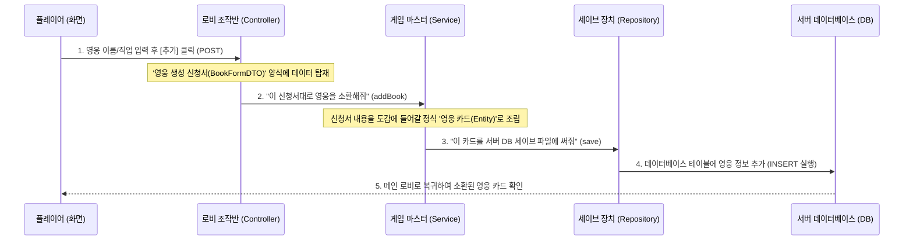
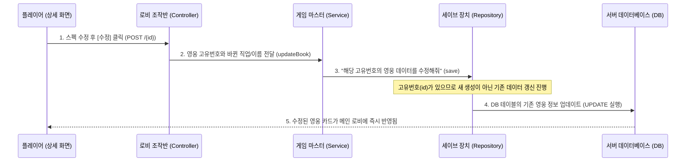
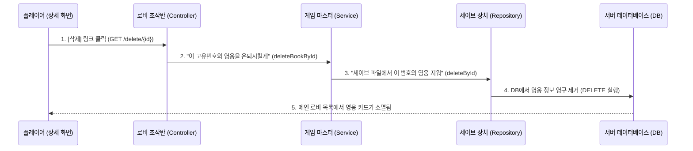

# 🎮 JPA 게임 영웅 도감 실습 정리

이 문서는 오늘 실습한 Spring Boot 및 JPA 기반의 **도서 관리 프로그램**을 코딩을 전혀 모르는 사람도 직관적으로 이해할 수 있도록 **"RPG 게임 영웅 도감 시스템"**에 비유하여 재해석한 설명서입니다.

*실제 코드의 `Book`은 영웅(Hero) 카드로, `title(책 제목)`은 영웅 이름으로, `author(작가)`는 영웅의 직업(클래스)으로 대입해서 이해하시면 완벽합니다!*

---

## 🕹️ 전체적인 동작 그림 (게임 시스템 비유)

우리가 만든 프로그램은 **"RPG 게임의 영웅 도감 및 길드 관리 시스템"**과 동일한 구조를 가지고 있습니다.

| 역할 | 프로그램 코드 이름 | 실제 게임 시스템에서의 비유 | 설명 |
| :--- | :--- | :--- | :--- |
| **도감 UI** | `index.jsp`, `detail.jsp` | **게임 로비 & 캐릭터 정보창** | 유저가 마우스로 클릭하여 새 캐릭터를 생성하거나, 스펙을 보고, 캐릭터를 삭제(은퇴)하는 게임 화면입니다. |
| **게임 로비 조작반** | `MainController` | **Lobby Router (로비 조작반)** | 유저가 화면에서 누른 조작(영웅 추가, 정보 보기, 닉네임 수정, 영웅 은퇴)을 접수해 게임 서버 엔진으로 전달하고, 바뀐 게임 화면을 유저에게 다시 그려줍니다. |
| **생성 요청서** | `BookFormDTO` | **영웅 생성 신청서 (Draft)** | 영웅을 새로 뽑거나 정보를 수정할 때, '이름'과 '직업'만 적어서 서버로 전송하는 일회성 데이터 패킷입니다. |
| **게임 서버 엔진** | `BookService` | **GM (게임 마스터 / 시스템 룰)** | 영웅이 도감에 정상적으로 등록될 수 있는지, 은퇴 처리가 가능한지 등 실제 게임 시스템의 비즈니스 룰을 검증하고 실행합니다. |
| **인벤토리 매니저** | `BookRepository` | **데이터베이스 커넥터 (DB Manager)** | 실제 게임 데이터가 영구 저장되는 데이터베이스 서버에 접근하여 영웅 데이터를 저장(`save`), 조회(`find`), 삭제(`delete`)하는 특수 장치입니다. |
| **표준 영웅 카드** | `Book` | **영웅 카드 (Hero Entity)** | 게임 서버 데이터베이스에 저장되기 위해 정해진 규격(고유 번호(ID), 영웅 이름, 직업)에 딱 맞게 제작된 표준 캐릭터 데이터 양식입니다. |
| **게임 서버 설정** | `application.properties` | **서버 config 파일** | 게임 서버 포트는 몇 번인지, 어떤 데이터베이스 세이브 파일에 연결할 것인지, 켜질 때 세이브 데이터를 초기화할지 설정하는 문서입니다. |

---

## 📁 파일별 상세 설명 (게임 관점)

### 1. ⚙️ 서버 설정서 (`application.properties`)
* **경로**: [application.properties](file:///C:/workspace/jpa/src/main/resources/application.properties)
* **쉬운 설명**: 게임 서버의 **"부팅 설정 파일"**입니다.
* **주요 역할**:
  * 게임을 시작할 때 임시 세이브 서버(H2 데이터베이스)를 켜고 접속할 주소를 연결합니다.
  * 서버 내부에서 세이브 데이터를 쓰고 읽을 때 수행되는 데이터베이스 언어(SQL)를 콘솔 창에 친절하게 띄워주도록 세팅합니다.
  * `ddl-auto=create` 옵션을 통해 서버를 새로 켤 때마다 기존 세이브 파일을 싹 밀고 새 게임으로 초기화하여 테스트하기 편하게 만듭니다.

### 2. 🛡️ 영웅 규격 데이터 (`Book.java` - 엔티티)
* **경로**: [Book.java](file:///C:/workspace/jpa/src/main/java/org/example/jpa/entity/Book.java)
* **쉬운 설명**: 게임 데이터베이스에 영구 소장될 **"표준 영웅 카드 설계도"**입니다.
* **주요 역할**:
  * 모든 캐릭터 카드는 아래 규격을 반드시 따릅니다.
    * `id` : 시스템이 영웅에게 부여하는 고유 번호 (예: 1번 영웅, 2번 영웅)
    * `title` : 영웅 닉네임 (게임 내 중복 불가능, 필수 입력)
    * `author` : 영웅의 직업 (예: 전사, 마법사, 궁수)
  * `@Getter`, `@Builder` 같은 편의 기능(Lombok) 덕분에 영웅 데이터를 복잡한 코드 없이 신속하게 생성하고 가져올 수 있습니다.

### 3. 🗝️ 세이브 장치 마스터키 (`BookRepository.java` - 저장소)
* **경로**: [BookRepository.java](file:///C:/workspace/jpa/src/main/java/org/example/jpa/repository/BookRepository.java)
* **쉬운 설명**: 데이터베이스 세이브 파일의 데이터를 직접 읽고 쓰는 **"도감 세이브 장치"**입니다.
* **주요 역할**:
  * 복잡한 저장 명령어나 쿼리 구문을 몰라도, `JpaRepository` 덕분에 자바 언어로 단순하게 저장/불러오기 명령만 내리면 실제 데이터베이스에 영구적으로 잘 기록됩니다.

### 4. 📝 영웅 등록 양식 (`BookFormDTO.java` - DTO)
* **경로**: [BookFormDTO.java](file:///C:/workspace/jpa/src/main/java/org/example/jpa/dto/BookFormDTO.java)
* **쉬운 설명**: 유저가 도감 생성 버튼을 누를 때 작성하는 **"영웅 정보 입력 서류"**입니다.
* **주요 역할**:
  * 세이브 데이터에 들어갈 완벽한 영웅 정보(`Book`)와 달리, 유저에게는 고유 번호(ID) 등을 입력받을 필요가 없으므로 오직 '이름'과 '직업' 정보만 받아 서버로 올려보내는 전송용 폼입니다.
  * 신청서를 받아 실제 도감에 꽂을 정식 영웅 카드 객체로 즉시 조립해 주는 `toEntity()` 기능을 탑재하고 있습니다.

### 5. 🧑‍💻 게임 마스터 엔진 (`BookService.java` - 서비스)
* **경로**: [BookService.java](file:///C:/workspace/jpa/src/main/java/org/example/jpa/service/BookService.java)
* **쉬운 설명**: 게임의 핵심 규칙을 판정하고 처리하는 **"GM (게임 마스터)"**입니다.
* **주요 역할**:
  * **영웅 영입 (`addBook`)**: 영웅 생성 신청서를 받아서 세이브 장치를 통해 DB 서버에 영웅을 추가합니다.
  * **도감 전체 조회 (`getAllBooks`)**: 현재 서버 데이터베이스에 존재하는 모든 영웅 목록을 수집합니다.
  * **특정 영웅 검색 (`getBookById`)**: 고유 번호로 영웅의 자세한 스펙을 검색하며, 만약 존재하지 않는 영웅이면 "데이터 없음" 예외를 던집니다.
  * **영웅 스펙 변경 (`updateBook`)**: 변경 정보를 바탕으로 세이브 장치에 갱신을 지시합니다.
  * **영웅 은퇴/삭제 (`deleteBookById`)**: 번호를 전달받아 도감에서 완전히 지워버립니다.

### 6. 💁 게임 로비 조작반 (`MainController.java` - 컨트롤러)
* **경로**: [MainController.java](file:///C:/workspace/jpa/src/main/java/org/example/jpa/controller/MainController.java)
* **쉬운 설명**: 게임 플레이어의 키보드/마우스 입력값을 받아 적절한 기능으로 넘겨주는 **"로비 메인 핸들러"**입니다.
* **주요 역할**:
  * 유저가 웹페이지에 접속하면 GM(Service)을 통해 모든 영웅 목록을 가져와 메인 로비(`index.jsp`)를 열어줍니다.
  * 유저가 새 영웅 생성 버튼을 누르면 영입 신청서(`BookFormDTO`)를 수집하여 GM에게 처리를 의뢰하고, 다시 로비로 리다이렉트합니다.
  * 상세 보기, 정보 수정, 은퇴 신청 등의 조작 신호를 받아 GM에게 전해주고 결과를 화면에 반영합니다.

### 7. 🖥️ 게임 화면 (`index.jsp` & `detail.jsp` - 뷰)
* **경로**:
  * [index.jsp](file:///C:/workspace/jpa/src/main/webapp/WEB-INF/views/index.jsp) (게임 로비 / 영웅 생성 및 도감 목록 화면)
  * [detail.jsp](file:///C:/workspace/jpa/src/main/webapp/WEB-INF/views/detail.jsp) (영웅 스펙 상세 화면 / 닉네임 수정 및 은퇴 버튼)
* **쉬운 설명**: 플레이어 눈에 보이는 **"게임 인터페이스(Web UI)"**입니다.

---

## 🔄 게임 액션별 시스템 동작 순서

유저가 마우스로 클릭을 했을 때 게임 백엔드 내부에서 정보가 어떻게 돌고 도는지 흐름을 알아봅시다.

### ➕ 1. 새로운 영웅을 소환(등록)할 때

### ✏️ 2. 영웅의 정보를 수정할 때 (예: 닉네임 변경)

### ❌ 3. 영웅을 은퇴(삭제)시킬 때

---

## 💡 요약: 왜 JPA(Java Persistence API)를 쓸까요?
* 과거의 게임 서버 개발자들은 유저의 세이브 데이터를 저장하거나 가져오기 위해 복잡한 데이터베이스 명령어(SQL)를 전부 수동으로 만들어주어야 했습니다.
* 하지만 **JPA** 덕분에 자바 코드로 만들어 둔 영웅 카드 객체 자체를 `save()` 장치에 밀어 넣기만 하면, 컴퓨터가 뒤에서 알아서 해당 데이터베이스에 완벽하게 동기화해 줍니다. 
* 덕분에 개발자는 데이터가 세이브 파일에 제대로 적히는지 일일이 걱정할 필요 없이, **"게임 콘텐츠와 룰(비즈니스 로직)"** 개발에 집중할 수 있습니다.
